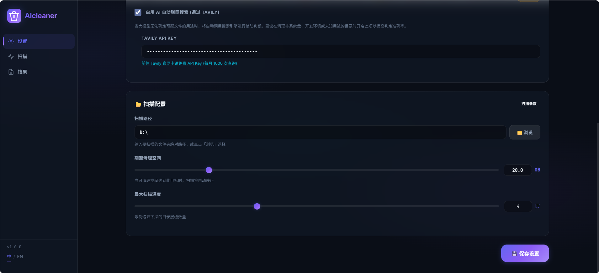
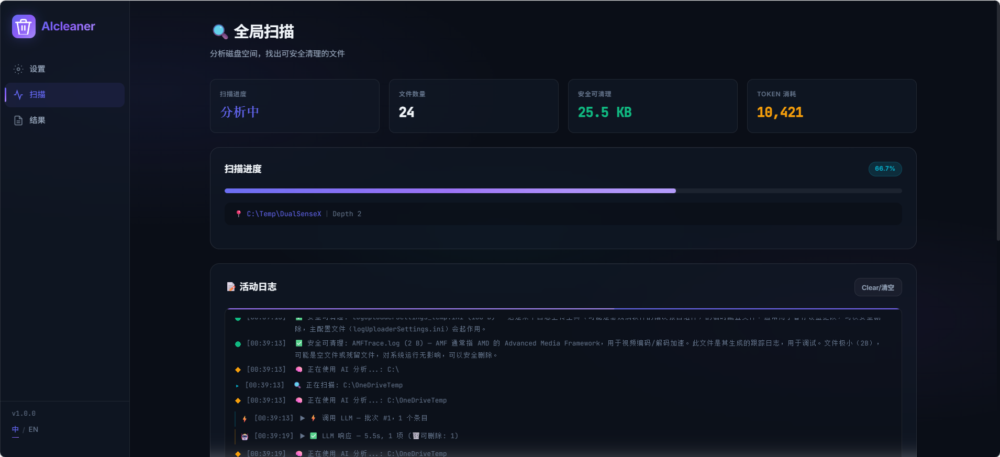
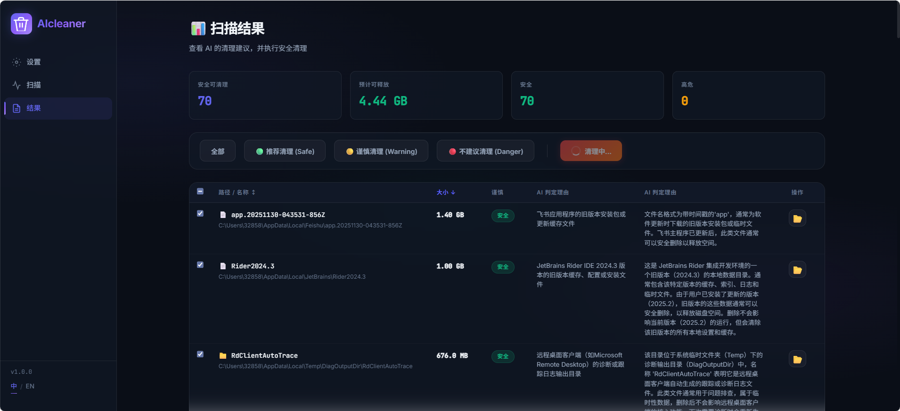

# AIcleaner ✨

[English Version Below](#english-version)

**AIcleaner** 是一款由人工智能驱动的智能磁盘空间清理工具。它将基于 Rust 的极速目录分析工具 [`dust`](https://github.com/bootandy/dust) 与大语言模型 (LLM) 的分析能力相结合，帮助您深入了解文件系统，精准定位占用空间庞大的文件，并在删除前提供详尽的风险评估，让您彻底告别误删系统文件的担忧。

## 🚀 核心功能

- **极速扫描引擎**：底层调用 `dust` 命令行工具，瞬间完成对深层目录树和超大文件的高效分析。
- **AI 安全护航**：在执行删除操作前，AI 将对文件及其所在目录进行智能分类和功能解析，直观展示删除风险，让清理决定有据可依。
- **现代化 UI 设计**：采用 HTML/CSS/JS 与 Vite 打造响应式玻璃拟态界面（Glassmorphism），提供丝滑的交互体验。
- **一键打包部署**：内置完善的构建脚本，支持生成绿色免安装版以及专业的 Windows 安装向导 (`.exe`)。

## 🛠️ 技术栈

- **前端**：全原生 HTML/CSS/JS 结合 Vite 构建工具
- **服务端**：Node.js, Express
- **AI 赋能**：支持 OpenAI / Gemini 等平台 API 接入
- **打包工具**：Inno Setup（制作 `.iss` 安装包），Windows 批处理脚本

## 📦 快速开始

### 环境依赖

- [Node.js](https://nodejs.org/) (推荐 v16 及以上版本)
- AI 提供商的 API Key (如 OpenAI, Gemini 等)

### 安装步骤

1. 克隆代码库：

   ```bash
   git clone https://github.com/hrhgit/AIcleaner.git
   cd AIcleaner
   ```

2. 安装依赖并自动下载底层清理组件：

   ```bash
   npm install
   ```

   *（注：执行 `npm install` 后的 `postinstall` 阶段将自动为您的操作系统下载适配的 `dust` 可执行文件）。*

3. 环境变量配置：
   您可以在根目录下创建 `.env` 文件存放环境变量，或者直接通过 UI 界面的“设置”选项填入您的 API Key。

### 启动开发环境

通过以下命令同时启动前端 Vite 服务和后端 Node.js 服务：

```bash
npm start
```

- 前端访问地址: `http://localhost:5173` (或 Vite 提示的其它端口)
- 服务端地址: `http://localhost:3001`

### 🏗️ 构建生产环境 (Windows)

如果您需要生成绿色发布文件以及 Windows 安装包 (`AIcleaner_Setup.exe`)，只需双击或在终端执行：

```cmd
build.bat
```

*提示：生成安装向导需确保系统中已安装 [Inno Setup 6](https://jrsoftware.org/isinfo.php)。如果只需要绿色版文件，直接拷贝脚本生成的 `release` 目录即可。*

## 📖 使用指南

### 1. 配置基础参数与 AI 辅助
首先打开左侧导航栏的 **⚙️ 设置** 界面。在这里，您需要配置扫描的基础参数和 AI 选项：
- **扫描配置**：设定要扫描的目标文件夹路径，并可通过滑块或输入框精确设定“期望清理空间”和“最大扫描深度”。
- **AI 联网搜索**：建议填入 Tavily API Key 并启用自动联网搜索。这能大幅提升 AI 对罕见或未知文件的判定准确率。
<div align="center">
  
</div>

### 2. 执行全局扫描
配置完毕后，切换到 **📈 扫描** 界面，系统将显示包含“分析中”状态的仪表盘。实时滚动的 **活动日志** 会展示当前正在被 `dust` 引擎扫描和 AI 处理的具体文件路径与耗时。在这个过程中，您可以直观地看到每个被扫描项的 AI 判定理由。
<div align="center">
  
</div>

### 3. 查看分析结果与执行清理
扫描完成后，点击进入 **📄 结果** 界面。顶部的统计面板会总结安全可清理的空间大小。
* **风险过滤**：利用分类按钮（全部、推荐清理 Safe、谨慎清理 Warning、不建议清理 Danger）快速筛选文件。
* **双重确认**：详细列表中展示了每个文件的大小和详细的 AI 判定理由。在勾选复选框决定是否批量删除前，您还可以点击右侧的 📁 图标直接**打开文件所在文件夹**进行最终的人工确认。确认无误后，点击“清理中...”按钮即可释放空间。
<div align="center">
  
</div>

## 🤝 参与贡献

欢迎提交 Issue 或 Pull Request，任何有助于项目完善的建议都会被认真采纳。详情请查看 [Issues 页面](https://github.com/yourusername/aicleaner/issues)。

## 📝 开源协议

本项目基于 MIT 协议开源。

---

# AIcleaner ✨ (English)

<a id="english-version"></a>

**AIcleaner** is an intelligent, AI-driven disk space cleaning tool. It combines the blazing-fast directory scanning of the [`dust`](https://github.com/bootandy/dust) CLI with the analytical power of Large Language Models (LLMs) to help you understand your file system, identify space hogs, and safely delete unnecessary files without the fear of breaking your system.

## 🚀 Features

- **Blazing Fast Scanning**: Utilizes the Rust-based `dust` CLI for high-performance disk usage analysis.
- **AI-Powered Safety Analysis**: Before you delete anything, AI analyzes the directories and files, categorizing them and explaining their purpose, minimizing the risk of accidentally deleting critical system or application files.
- **Modern Glassmorphism UI**: A beautiful, responsive, and dynamic user interface built with HTML/CSS/JS and Vite.
- **Standalone Windows Installer**: Effortlessly package the application into a standalone Windows installer (`.exe`) or a portable version using the provided build scripts.

## 🛠️ Technology Stack

- **Frontend**: Vanilla JS, HTML, CSS (Vite)
- **Backend**: Node.js, Express
- **AI Integration**: OpenAI / Gemini APIs
- **Packaging**: Inno Setup (`.iss`), Windows Batch Scripts

## 📦 Getting Started

### Prerequisites

- [Node.js](https://nodejs.org/) (v16 or higher recommended)
- API Key (OpenAI, Gemini, or other supported AI providers)

### Installation

1. Clone the repository:

   ```bash
   git clone https://github.com/yourusername/aicleaner.git
   cd aicleaner
   ```

2. Install dependencies:

   ```bash
   npm install
   ```

   *(Note: The `postinstall` script automatically downloads the necessary `dust` CLI executable for your platform).*

3. Set up your environment variables:
   Create a `.env` file in the root directory (or use the built-in UI settings) to configure your AI API keys.

### Running in Development

Start both the Vite frontend and the Node.js backend concurrently:

```bash
npm start
```

- Frontend: `http://localhost:5173` (or depending on your Vite config)
- Backend Server: `http://localhost:3001`

### 🏗️ Building for Production (Windows)

To create a portable release and a standalone Windows setup executable (`AIcleaner_Setup.exe`), simply run the build script:

```cmd
build.bat
```

*Note: Building the installer requires [Inno Setup 6](https://jrsoftware.org/isinfo.php) installed on your system. If you just want the portable version, you can grab the `release` folder generated by the script.*

## 📖 Usage Guide

### 1. Configure Parameters and AI Assistance
First, open the **⚙️ Settings** interface from the left sidebar. Here, configure your scanning parameters and AI options:
- **Scan Configuration**: Set the target folder path to scan. You can also precisely adjust the "Target Clean Size" and "Max Scan Depth" using the sliders or input fields.
- **AI Web Search**: We recommend entering a Tavily API Key and enabling automatic web search. This significantly improves the AI's accuracy when evaluating rare or unknown files.
<div align="center">
  
</div>

### 2. Execute Global Scan
After configuration, switch to the **📈 Scan** interface. You will see a dashboard displaying the "Analyzing" status. The real-time **Activity Log** shows the specific file paths and processing times as the `dust` engine scans and the AI evaluates them. You can monitor the AI's reasoning for each item in real-time.
<div align="center">
  
</div>

### 3. Review Analysis Results and Clean Up
Once the scan concludes, navigate to the **📄 Results** interface. The top statistics panel summarizes the total space that is safe to clean.
- **Risk Filtering**: Use the category buttons (All, Safe, Warning, Danger) to quickly filter the identified files.
- **Double Verification**: The detailed list shows the size and the complete AI justification for each item. Before checking the boxes for bulk deletion, click the 📁 icon on the right to directly **open the containing folder** for a final manual check. Once confirmed, click the clean button to free up space.
<div align="center">
  
</div>

## 🤝 Contributing

Contributions, issues, and feature requests are welcome! Feel free to check the [issues page](https://github.com/yourusername/aicleaner/issues).

## 📝 License

This project is licensed under the MIT License.
