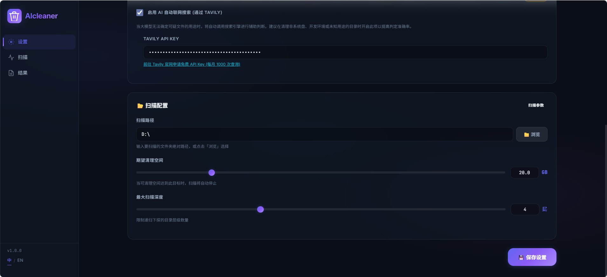
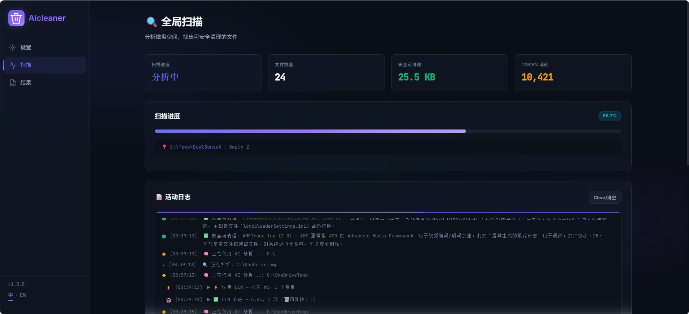
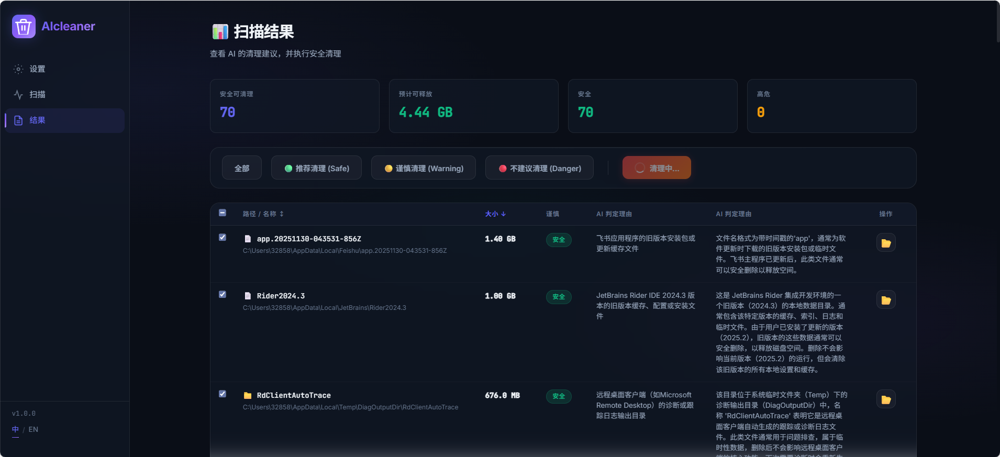

# AIcleaner ✨

[English Version Below](#english-version)

**AIcleaner** 是一个 Tauri 桌面应用，结合 Rust 扫描 sidecar 与大模型分析能力，帮助用户定位可清理文件、评估清理风险，并执行更安全的磁盘整理。

## 核心特性

- Rust 扫描 sidecar 负责高速索引文件与目录，适合大目录树和历史结果查询。
- Tauri v2 后端通过 commands 和事件流驱动扫描、整理、清理等桌面能力。
- 前端使用 Vite + 原生 HTML/CSS/JS，运行于 Tauri WebView。
- 支持 OpenAI、Gemini、GLM 等模型提供商配置与 AI 辅助分析。

## 技术栈

- 前端：Vite + Vanilla JS
- 桌面端：Tauri v2 + Rust
- 本地扫描：Rust sidecar (`native/scanner` -> `bin/scanner.exe`)
- 打包：Tauri Bundle（Windows NSIS）

## 快速开始

### 环境要求

- [Node.js](https://nodejs.org/) 16+
- Rust / Cargo 工具链
- Windows 开发环境

### 安装依赖

```bash
npm install
```

如果仓库中不存在 `bin/scanner.exe`，可运行启动脚本自动构建，或手动执行：

```bash
cd native/scanner
cargo build --release
```

然后将生成的 `scanner.exe` 复制到 `bin/`。

### 开发启动

推荐直接使用：

```bash
./start-tauri.ps1
```

或：

```bash
npm run tauri:dev
```

说明：

- 当前仓库已收敛为 **Tauri-only**，不再提供 Node/Express 本地 HTTP 服务。
- 前端仅支持在 Tauri 容器内运行，直接用浏览器打开 Vite 页面不属于受支持模式。

### 生产构建

```bash
npm run tauri:build
```

Windows 安装包输出目录：

`src-tauri/target/release/bundle/nsis/`

## 使用说明

### 1. 设置

在 **设置** 页面配置：

- 扫描目录
- 目标清理空间
- 最大扫描深度
- AI 提供商与模型
- 联网搜索相关配置

应用数据会保存在 Tauri 的应用数据目录中，不再使用仓库内的 `server/data/`。

<div align="center">
  
</div>

### 2. 扫描

在 **扫描** 页面启动任务后，界面会通过 Tauri 事件流展示扫描进度、发现项和 AI 分析状态。

<div align="center">
  
</div>

### 3. 结果与清理

在 **结果** 页面查看候选项、风险等级和 AI 解释，确认后执行批量清理；对于目录类候选项，应用会清空其内容并保留目录本身。

<div align="center">
  
</div>

## 开发说明

- 前端与桌面后端接口统一通过 Tauri `invoke` / event stream 通信。
- 仓库不再保留 `/api/*` HTTP 回退接口。
- 旧 Node 服务器、旧便携版启动脚本和旧 Inno Setup 打包链路已移除。

## License

MIT

---

# AIcleaner ✨ (English)

<a id="english-version"></a>

**AIcleaner** is a Tauri desktop application that combines a Rust scanner sidecar with LLM-based analysis to identify cleanup candidates, explain risk, and help users clean disk space more safely.

## Highlights

- A Rust scanner sidecar indexes files and directories efficiently for large trees and history queries.
- Tauri v2 handles desktop capabilities through Rust commands and event streams.
- The frontend is built with Vite and vanilla HTML/CSS/JS and runs inside Tauri WebView.
- AI-assisted analysis supports providers such as OpenAI, Gemini, and GLM.

## Stack

- Frontend: Vite + Vanilla JS
- Desktop runtime: Tauri v2 + Rust
- Native scanner: Rust sidecar (`native/scanner` -> `bin/scanner.exe`)
- Packaging: Tauri Bundle (Windows NSIS)

## Getting Started

### Requirements

- [Node.js](https://nodejs.org/) 16+
- Rust / Cargo toolchain
- Windows development environment

### Install Dependencies

```bash
npm install
```

If `bin/scanner.exe` is missing, build it automatically through the launcher script or manually:

```bash
cd native/scanner
cargo build --release
```

Then copy the produced `scanner.exe` into `bin/`.

### Run in Development

Recommended:

```bash
./start-tauri.ps1
```

Or:

```bash
npm run tauri:dev
```

Notes:

- The repository is now **Tauri-only** and no longer ships a Node/Express local HTTP backend.
- The frontend is only supported inside the Tauri runtime; opening the Vite page directly in a browser is not a supported mode.

### Production Build

```bash
npm run tauri:build
```

Windows installer output:

`src-tauri/target/release/bundle/nsis/`

## Usage

### 1. Settings

Configure the following in the **Settings** page:

- scan target folder
- desired cleanup size
- max scan depth
- AI provider and model
- optional web search settings

Application data is stored in the Tauri app data directory rather than `server/data/` inside the repository.

<div align="center">
  
</div>

### 2. Scan

Start a task from the **Scan** page. Progress, discoveries, and AI analysis updates are delivered through Tauri event streams.

<div align="center">
  
</div>

### 3. Results and Cleanup

Review candidates, risk levels, and AI explanations on the **Results** page, then run cleanup after confirmation. For directory candidates, the app clears contents while preserving the directory itself.

<div align="center">
  
</div>

## Development Notes

- Frontend-to-backend communication is unified on Tauri `invoke` and event streams.
- `/api/*` HTTP fallback endpoints are no longer part of the project.
- The legacy Node server, portable launcher flow, and old Inno Setup packaging path have been removed.

## License

MIT
